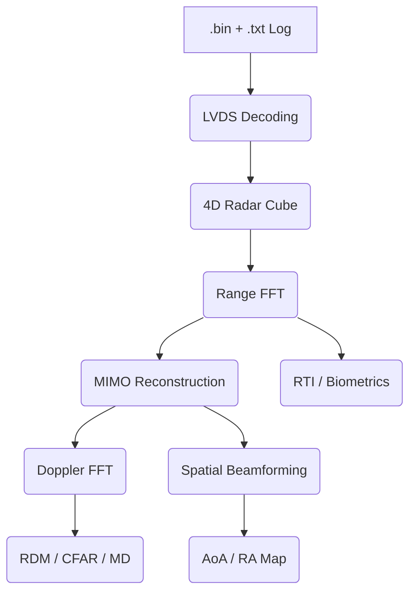

# DARTscope v1.0

A comprehensive, high-performance suite of tools for inspecting, processing, and visualizing TI mmWave radar data captured using the DCA1000 EVM. This project provides a full-featured GUI for detailed signal analysis and lightweight CLI scripts for quick visualization.

## Quick Start Guide

### 1. Prerequisites
- **Python 3.8+**
- **Core Dependencies**: `numpy`, `matplotlib`, `scipy`, `tkinter`
- **Video Export**: `ffmpeg` must be installed and available in your system PATH to export processing sequences as MP4.

### 2. Launching the Application
Run the main GUI:
```bash
python DCA_processing.py
```

### 3. Step-by-Step Data Loading
1. **Open BIN**: Click the "Open BIN" button and select your raw ADC data file (e.g., `adc_data_Raw_0.bin`).
2. **Log Discovery**: The app automatically searches for the corresponding `_LogFile.txt` in the same directory. This log is crucial as it contains all hardware parameters (sampling rate, slope, chirps, lanes).
3. **Decode & Load**: Click "Decode & Load".
    - The **Parameter View** will populate with grouped hardware settings (Profile, Chirp, Frame, Data Format).
    - The raw data is demultiplexed and reshaped into a 4D Radar Cube: `[Frames, Chirps, RX, Samples]`.
4. **Global Controls**: Once loaded, use the **Global Frame** slider at the top to navigate through the capture. Use the **Antenna** selector to choose between MRC (Maximum Ratio Combining), SUM, or individual RX channels.

---

## Codebase Structure

The toolbox is organized into functional modules to separate hardware-specific decoding from high-level signal processing and UI management.

| Module | Responsibility |
|:---|:---|
| **`DCA_processing.py`** | Main entry point. Manages the multi-tabbed Tkinter GUI, global state, playback synchronization, and integrates all processing modules. |
| **`dca1000_decode.py`** | Robust parser for mmWave Studio logs. Derives physical parameters (Slope, $f_{start}$, $B_{eff}$, $dR$) and determines LVDS lane/format settings. |
| **`radar_processing.py`** | Core signal engine. Implements the LVDS demultiplexer, 4D Radar Cube construction, Range FFT, and Range-Doppler Map generation. |
| **`AOA.py`** | Spatial processing suite. Handles virtual antenna array geometry (MIMO), phase/amplitude calibration, and 1D/2D Beamforming (Bartlett/Capon). |
| **`detection.py`** | Target detection algorithms. Implements 2D CA-CFAR and OS-CFAR for Range-Doppler maps, along with clustering and peak extraction. |
| **`gui_helper.py`** | Backend for the "Radar Design Helper". Contains the logic for the radar experiment calculator and mmWave Studio command generator. |
| **`range_fft.py`**, **`rti.py`**, **`range_profile.py`** | Modular, reusable components for specific Range-domain visualizations. |
| **`recents.py`** | Utility for managing the "Recently Opened Files" history in a JSON-backed persistent store. |
| **`rd_viz_min_GUI.py`** / **`rd_viz_min.py`** | Lightweight, standalone visualizer for quick data checks without the full processing suite. |


---

## Technical Pipeline Deep Dive

### 1. Data Ingestion & Parameter Normalization
The pipeline starts by synchronizing a raw `.bin` file with its mmWave Studio `_LogFile.txt`. 
- **Log Parsing**: The system extracts raw API constants and converts them to SI units using chip-specific LSB factors (e.g., $3.6 \times 2^{-26}$ for 77GHz start frequency).
- **Physical Derivation**: 
  - Effective Bandwidth ($B_{eff}$): $Slope \times ADC\_Samples / F_{sampling}$
  - Range Resolution ($dR$): $c / (2 \times B_{eff})$
  - Max Velocity ($v_{max}$): $\lambda / (4 \times T_{chirp})$

### 2. LVDS Decoding (Demux)
Raw DCA1000 data is a serialized stream of `int16` values from multiple LVDS lanes.
- **Lane Reordering**: Corrects hardware wiring (Lane Swap $1 \leftrightarrow 2$).
- **Demultiplexing**: Reconstructs the interleaved stream based on the format (Complex1x, Complex2x, or Real).
- **IQ Reconstruction**: Handles $I+jQ$ or $Q+jI$ (IQ Swap) based on the `iqOrder` flag.
- **Result**: A 4D Radar Cube $\mathcal{X} \in \mathbb{C}^{F \times C \times RX \times N_s}$.

### 3. Range Processing (Fast-Time FFT)
Executed per chirp to transform time-domain samples into range bins.
$$R(k) = \text{FFT}(\text{Window} \cdot (x(n) - \bar{x}))$$
- **DC Removal**: Crucial for eliminating static leakage before windowing.
- **Full Spectrum Handling**: For Complex1X, the pipeline maintains the full complex bandwidth to avoid aliasing and mirroring.

### 4. Doppler Processing (Slow-Time FFT)
Transforms the sequence of chirps into velocity information.
- **TDM-MIMO Demux**: If multiple TX antennas are used in time-division, the system separates them into virtual channels.
- **Static Clutter Removal**: Subtracts the mean of the slow-time signal to suppress stationary reflections (trees, walls).
- **2D FFT**: A second FFT across the "chirp" dimension produces the Range-Doppler Map (RDM).

### 5. Spatial Processing (AoA)
Determines the angle of targets relative to the radar.
- **Virtual Array Formation**: Combines $N_{TX} \times N_{RX}$ physical channels into a virtual Uniform Linear Array (ULA) or 2D grid (for IWR6843AOP).
- **Beamforming (Bartlett)**:
  $$P(\theta) = | \mathbf{a}(\theta)^H \mathbf{x} |^2$$
  where $\mathbf{a}(\theta)$ is the steering vector for angle $\theta$.
- **Calibration**: Multiplies virtual channels by complex coefficients (`antPhaseRot`) to correct for phase offsets.

---

## Detailed Module Breakdown

### Data Decoding & Parameters (Tab: Decode)
- **Log Parsing**: Extracts `ProfileConfig`, `ChirpConfig`, and `FrameConfig` from mmWave Studio logs.
- **LVDS Demux**: Supports 1, 2, or 4 lanes. Automatically handles IQ/QI order and interleaved/non-interleaved formats based on the log hints.
- **Lane Swap**: Provides a toggle for `1 <-> 2` lane swapping to fix potential hardware wiring artifacts.

### Range Analysis (Tab: Range FFT / RTI / Profile)
- **Range FFT**: Converts fast-time ADC samples to range bins using a Hann window and DC removal.
    - *Full Spectrum*: Toggle to see the full complex bandwidth.
    - *Stationary Removal*: Adaptive background subtraction to highlight moving targets.
- **RTI (Range-Time Intensity)**: Visualizes target movement over the entire capture duration.
    - *Processing*: Stacks Range FFTs of all chirps/frames, applies a DC/edge notch filter.
- **Range Profile (dBFS)**: Accurate power estimation relative to the ADC Full Scale. Supports coherent averaging across chirps for better SNR.

### Velocity & Movement (Tab: Range-Doppler / Micro-Doppler)
- **Range-Doppler Map (RDM)**: Computes 2D FFT (Fast-time + Slow-time).
    - *TDM-MIMO*: Separates chirps by TX mask to reconstruct virtual antenna arrays.
    - *Clutter Removal*: Subtraction of mean slow-time signal to eliminate static reflections.
    - *Doppler Windowing*: Optional Hann/Hamming windows to reduce velocity side-lobes.
- **Micro-Doppler (MD)**: Analyzes fine vibrations and rotations.
    - *Processing*: Extracts Doppler spectra over time for specific range bins (e.g., detecting gait or fan rotation).

### Spatial Analysis (Tab: AoA / 2D AoA)
- **Angle-of-Arrival (AoA)**: 1D Azimuth beamforming.
    - *MIMO Expansion*: Automatically forms a virtual ULA (Uniform Linear Array) from physical RX and TDM-TX positions.
    - *Methods*: Bartlett (standard) or Capon (high-resolution) beamforming.
- **2D RA/AE Maps**: Range-Azimuth and Azimuth-Elevation heatmaps.
    - *Calibration*: Applies `antPhaseRot` and `compRangeBiasAndRxChanPhase` parameters from the log for accurate spatial mapping.

### Biometrics (Tab: 1D View)
- **Breath & Heart Rate**: Dedicated temporal FFT analysis for a single range bin.
    - *Frequency Separation*: Categorizes energy into Noise/DC, Breathing (0.1–0.6 Hz), and Heart Rate (0.8–3.5 Hz).
    - *Peak Tracking*: Automatically estimates BPM (Beats Per Minute) for physiological monitoring.

### Detection (Tab: CFAR)
- **2D CA-CFAR**: Constant False Alarm Rate detector.
    - *Parameters*: Adjustable Guard and Training cell sizes.
    - *Thresholding*: Adaptive threshold based on local noise estimation (Average or Ordered Statistic).
    - *Clustering*: Groups detected pixels into targets and extracts physical Range/Velocity coordinates.

---

### Target Detection & Analysis

#### 2D CA-CFAR (Cell-Averaging Constant False Alarm Rate)
To distinguish targets from noise, the system implements an adaptive threshold detector:
1. **Windowing**: A sliding window of size $(2 \cdot T + 2 \cdot G + 1)$ is centered on the Cell Under Test (CUT).
2. **Exclusion**: $G$ guard cells are excluded to prevent target energy from leaking into the noise estimate.
3. **Estimation**: Noise level $P_{noise}$ is calculated as the average power in $T$ training cells.
4. **Decision**: A detection is declared if $P_{CUT} > P_{noise} \cdot \alpha$, where $\alpha$ is the threshold factor.

#### Biometric Extraction (Phase Analysis)
For physiological monitoring, the system performs a temporal analysis on a stable range bin:
1. **Unwrapping**: The phase of the complex Range-FFT peak is unwrapped to track displacement.
2. **Filtering**: Band-pass filters separate the signal into Breathing (0.1–0.6 Hz) and Heart Rate (0.8–3.5 Hz).
3. **Spectral Estimation**: An FFT is performed on the filtered phase signal to find the peak frequency, which is converted to BPM (Beats Per Minute).

---

## Radar Design Helper (Tab: Helper)
A built-in calculator to design your own radar experiments:
- **Presets**: Quick settings for "Long Range (Macro)" or "Short Range (Respiration)".
- **Constraints**: Automatically validates your goals (Range/Velocity resolution) against hardware limits (Bandwidth, ADC rate, Duty cycle).
- **Command Generator**: Outputs a block of mmWave Studio commands ready to be used for sensor configuration.

---

## Export Capabilities
Every visualization card features an **Export** button:
- **Current frame**: Save the current plot as a high-resolution **PNG**.
- **Data**: Export the raw processed matrix (e.g., RDM or AoA spectrum) as **CSV**.
- **All frames**: Render the entire capture as an **MP4 video** (requires ffmpeg).

## Advanced Features & Troubleshooting

### Lane Swapping & IQ Order
Different TI hardware revisions (AOP vs. non-AOP) might have different lane assignments or IQ orderings.
- If your Range FFT looks like a mirrored image or contains heavy noise, try toggling **Lane Swap (1<->2)** or checking the **IQ Swap** settings in the Decode tab.
- The **Antenna Combine** mode (MRC vs SUM) can significantly impact SNR; MRC is generally preferred for non-coherent targets.

### Processing Performance
Processing large `.bin` files (multiple GBs) can be memory-intensive.
- The app uses `numpy` memory mapping and efficient reshaping, but ensure you have enough RAM for the full 4D cube.
- Use the **Minimal Visualizer** (`rd_viz_min_GUI.py`) if you only need a quick RDM check without loading the full suite.

### Video Export Requirements
Video export is powered by `matplotlib.animation`.
- Ensure `ffmpeg` is in your PATH. You can verify this by running `ffmpeg -version` in your terminal.
- Rendering can take some time depending on the number of frames and the complexity of the plot.

---

## Processing Chain Architecture


## Authors
**Daniel Barvík** [ORCID: 0000-0001-7699-8792](https://orcid.org/0000-0001-7699-8792)

**Dan Hrubý** [ORCID: 0009-0009-7109-9734](https://orcid.org/0009-0009-7109-9734)

*Part of the [HEALTH.Lab](https://www.fei.vsb.cz/450/en/science-and-research/labs/HEALTHlab/) research.*

---

## License

DARTscope is released under the [MIT License](LICENSE) — free to use, modify, and distribute.

If you use DARTscope in your research or work, please reference it as:

> Daniel Barvík, Dan Hrubý. *DARTscope* (2025). GitHub: https://github.com/HealthLabVSB/DARTscope

A machine-readable citation is available in [CITATION.cff](CITATION.cff). 
